Cindermedusae - Les Créatures Génératives
=========================================

:date: 2012-12-12
:category: art,informatique
:level: avancé
:author: Marcin Ignac
:translator: Tarek Ziadé

.. note::

   **ARTICLE EN COURS DE TRADUCTION**

.. note::

   Cet article est une traduction de l'article de Marcin Ignac
   originalement paru en anglais sur son blog à
   `cette addresse <http://marcinignac.com/blog/cindermedusae-making-generative-creatures>`_.

   Vous pouvez retrouvez tous les projets de Marcin ici:
   http://marcinignac.com/projects/category/featured/

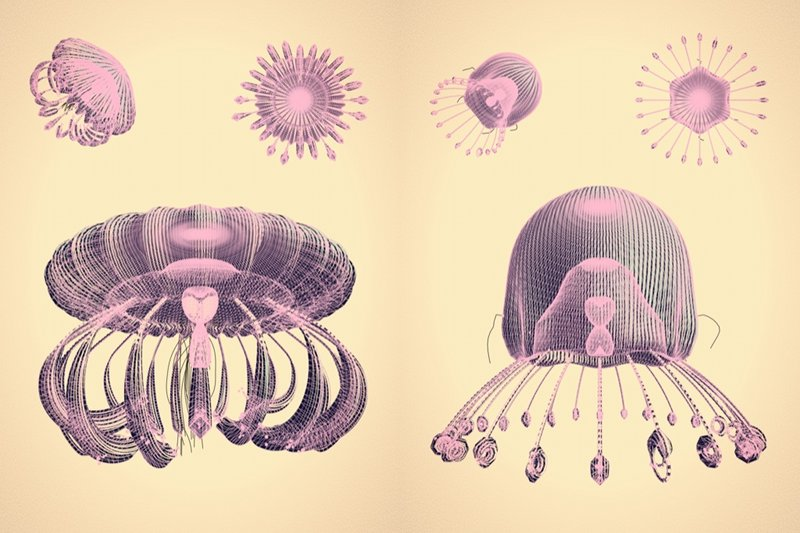

Cindermedusae is quite a special project for me. It was super fast (about one
week) and quite intensive (several late nights) yet very successful and
rewarding when it comes to results. I liked the idea of generative book from
the very beginning so I was very excited about Written Images competition when
I heard about it for the first time. At this moment I was still working at
shiftcontrol on underwater game project for ZDF called Universum Der Oceane in
collaboration with Hosoya Schaefer Architects. More info about that project is
here. We had many meetings and discussions about gameplay, creature behaviors
and procedural animation so this is probably where I got interested in giant
jellyfish. They are astonishingly interesting creatures - I like they way the
move, so slowly. Perfect choice for a little bit of coded mesh bending.

Géometrie procédurale
:::::::::::::::::::::

It's not the first time I was doing procedural geometry. Actually it's what all
the demoscene is about. One example could be cactus-like torus in our intro
called Borntro. Although original Cindermedusae code is in C++/Cinder I'll
describe some basic ideas behind jellyfish geometry generation with
accompanying code examples in ProcessingJS. Most of them will be in 2d and
interactive so it's easier to get the idea (and draw it!). In few cases when I
use 3d you will need WebGL capable browser to view them properly.

Head
----

Let's start with a circle (or sphere in 3d) and view from the top. It's a
collection of points that distance r is constant from a given point called
circle's center. If that point is (0, 0) then any point on the circle can be
described as a function of angle phi from 0 to 2*PI::

    x = r * cos(phi)
    y = r * sin(phi)

In the next step we dynamically adjust the radius with a sine wave so it will
change from 0.925 to 1.075 (92.5% - 107.5% of it's length). We multiply theta
by 10 so we will have our wave going up and down ten times.

::

    x = r * (1 + 0.075 * cos(phi * 10)) * cos(phi)
    y = r * (1 + 0.075 * cos(phi * 10)) * sin(phi)

The red lines in the last step are segments we selected as start point for
tentacles. We will use them in the future.

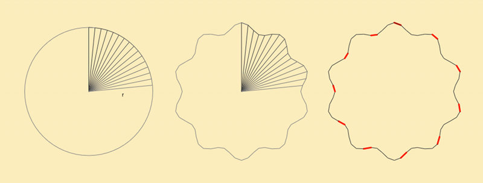

If we look at the head of our jellyfish for a side it's also a circle. In the
end we are playing with spheres in 3d, don't we? The difference is that this
time the angle theta changes from 0 at the top to PI at the bottom. The head is
symmetrical along Y axis so we will construct two points in every step - one on
the left and one on the right side::

    x = r * cos(theta)
    y = r * sin(theta)
    x' = -x
    y' =  y

Because jellyfish head is more like a dome than a sphere we want to make a
shape that is convex on the top and concave on the bottom. All we have to do is
to flip y coordinate after we reach certain angle (PI/2 or 90' in this case).
We also add r/2 to push it a little bit down (otherwise both halves of the
circle would overlap).

::

    if (theta < PI/2) {
        x = r * cos(theta) y = r * sin(theta)
    } else {
        x = r * cos(theta)
        y = -r * sin(theta) + r * 0.5
    }

In the last step we smooth the edge around point when we wrap the circle for
nicer look and to avoid shading artifacts. I won't describe it here because
it's yet another if and sin() so please refer to the source code for details.

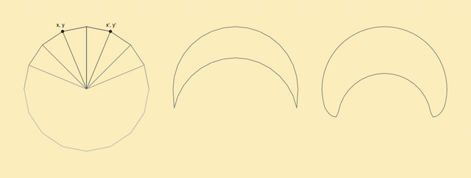

There are better ways to animate our jelly but because Written Images wasn't an
animation competition I used the simplest one - sin(). Nobody will see the
difference on a static image anyway. Every frame after calculating points
positions x,y I also calculate surface normals. Next if the animation is turned
on I move the point along the normal according to the value of sin() function
at given moment in time t. This moves our points in and out but if we stopped
here our head would just pulsate, growing bigger and smaller - all points at
the same time. That's why I add y*0.5 to t so I introduce phase shift along Y
axis and the mesh starts wobbling.

::

    x += normal.x * sin(t + y * 0.5)
    y += normal.y * sin(t + y * 0.5)

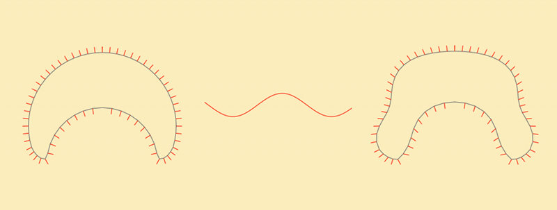

As an excercise I decided to try to combine all above steps and code it in 3d
using JavaScript and ProcessingJS. I was surprised that it's almost copy&paste
of my C++ code. I tried to keep the code as simple as possible so it's not the
most optimized version, performance suffers a lot.

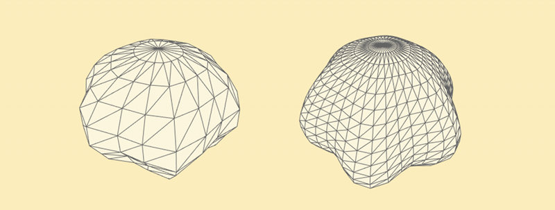

Tentacules
----------

Problem: Given a curve (or rather polyline) build a tube-like mesh around it.

Solution: We start with three perpendicular vectors: Forward (usually the
normal in point when I want to attach the tentacle or if we have curve formula
it would be the tangent vector), Up (arbitrarily chosen by me (0,1,0)) and Left
that can be calculated using Right-hand rule as::

    L = U x F

Where x is the cross product of two three dimensional vectors. Now if for the
second point we have new F' vector but the same L vector we can calculate the
new U' as::

    U = F x L

Then we repeat this steps for each point / segment of the line to calculate new
coordinate base from Up, Front and Left.

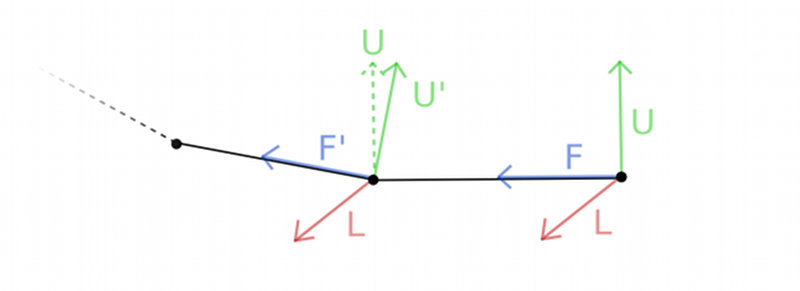

All this is basically borrowing ideas from Frenet–Serret frame without playing
with calculus to much. If you are coding in Cinder don't event bother
implementing it by yourself. Chaoticbob already did that for you and
implemented even better Parallel Transport Frames.

When we have all the Up and Forward vectors it's easy to start building
triangles. In the following example I added to more things. First, the Up
vector gets smaller and smaller towards the tip of the tentacle. Second, based
on the mouse position I bend the tentacle. It bends more the closer to the end.
This bending force is visualized by red lines.

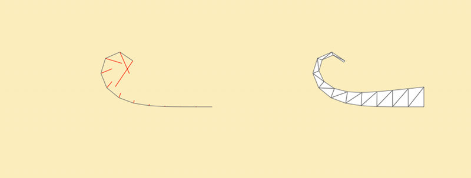

Now we are ready to attach the tentacles to the head. I'm merging geometry at
all because shading will hide any discontinuities on the surface.

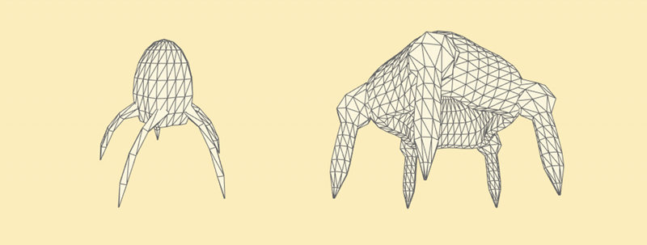

Géométrie finale
----------------

The geometry I used for renders is much higher density mostly to have nice
smooth curves and avoid antialiasing artifacts.

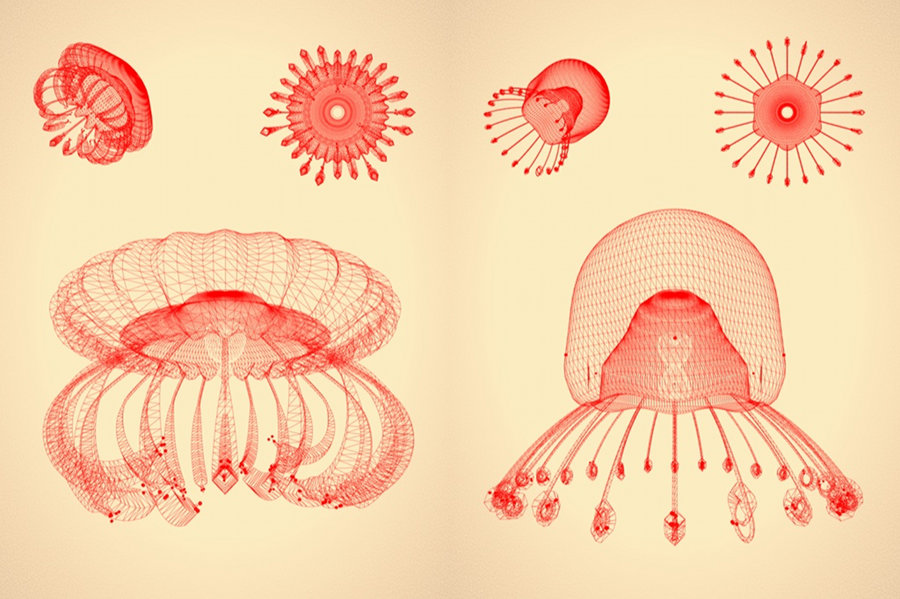

Procedural shading
::::::::::::::::::

When I started I was aiming for very natural look so I was experimenting with
Subsurface Scattering and even managed to get some decent looking results. I
changed my mind after stumbling upon works by Ernst Haeckel and his amazing
book "Kunstformen der Natur" - I knew that this is the way to go.

First step is to use standard diffuse lighting just to see if my mesh is smooth
enough and I don't have any strange behaving normals

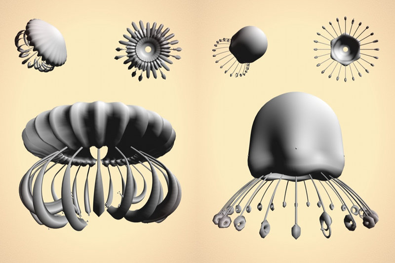

Hatching
::::::::

There are many research papers on how to achieve sketchy look in realtime. I
based my implementation on code from OpenGL Shading Language Book. The
algorithm first generate vertical stripes along texture coordinates and then
chooses the stripe density based on diffuse lighting. The less light the more
dense the black stripes are. One important aspect was to choose the the right
width of the stripes so to output is visually interesting but we don't get too
much Moiré effect. Big offscreen FBO (4080 × 2720 px) and antialiasing helps a
lot.

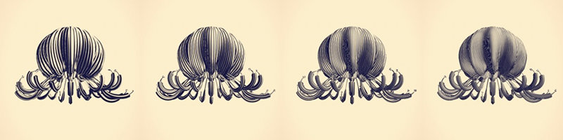

Unfortunately There will be no ProcessingJS examples in this part because some
features depends on WebGL GLSL extensions like GL_OES_standard_derivatives and
dFdx / dFdy functions that are not supported by any WebGL implementation I know
yet. Copy pasting source code also doesn't make sense so please refer to the
book if interested.

Colors
::::::

Every image is composited out of 5 layers:

yellow background color orange page corders dirt black sketchy hatch blue
highlights and pink borders

Both orange page corners and blue highlights are masked by noise so they look
like drawn using crayons.

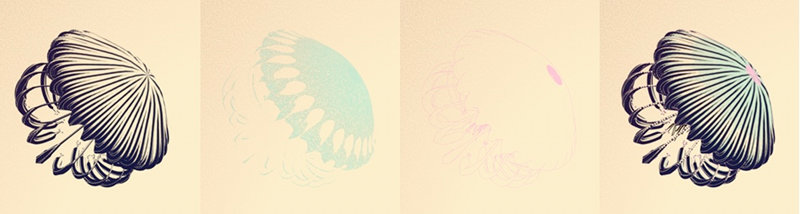

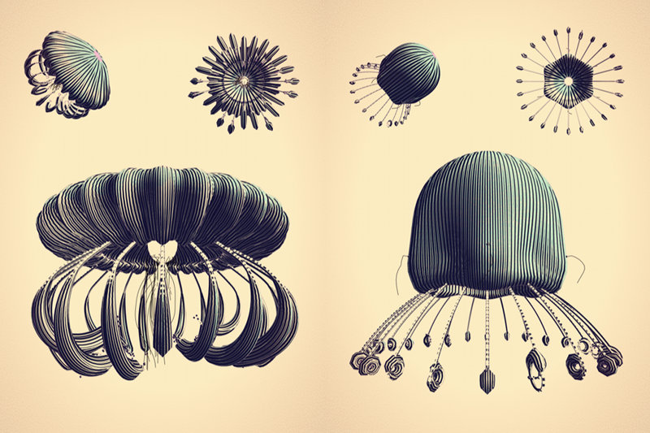

Paramétrage
:::::::::::

Very important thing to mention is that all the parameters are exposed through
simple GUI system I developed. This allows my to play with them and see how
shape of the creature changes and what should be minimal and maximum values
that makes sense. Having that I can simply choose a random value for each
variable and be sure every jellyfish will look ok.

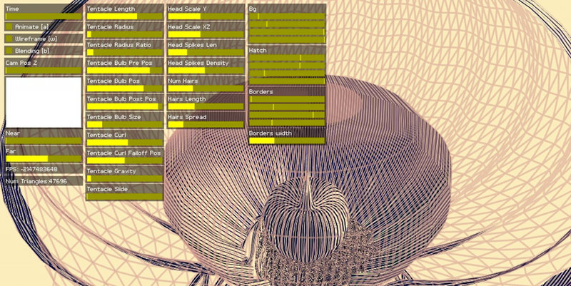

La suite ?
::::::::::

I want to work more on this project. First obvious step would be to optimize it
so it runs on a decent framerate when animated. Right now it's around 10fps. I
was thinkning about making WebGL port so people can create their own creatures
online. The plan is also to extend the system and play with different organism
types or plants.
