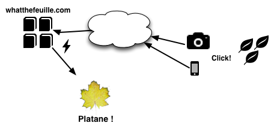
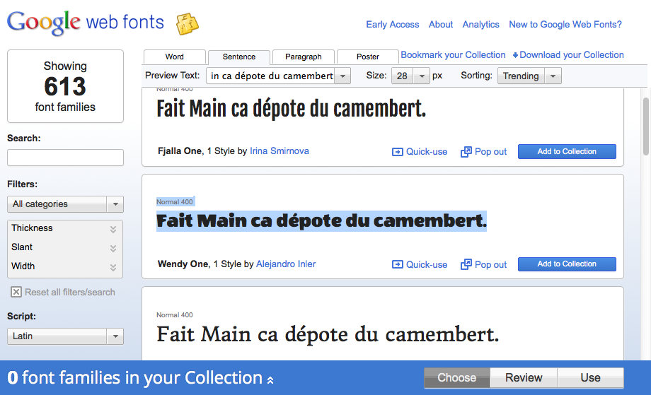
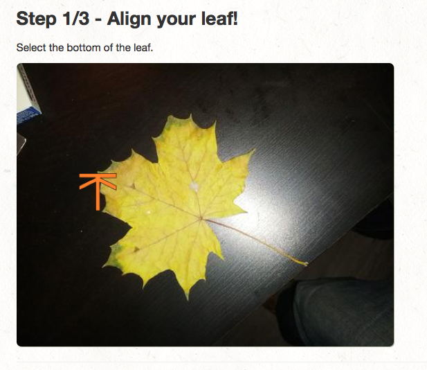

What The Feuille ?
==================

|info| **Ecologie** | **Informatique** |pen| *Tarek Ziadé*

.. image:: https://farm9.staticflickr.com/8064/8239976465_6c760b1090_c.jpg
   :target: https://secure.flickr.com/photos/kennethreitz/8239976465/in/set-72157632156365245/
   :alt: Tarek & Ronan en train de tester What The Feuille.

Le `Hackaton <https://fr.wikipedia.org/wiki/Hackathon>`_ est un mot-valise,
m'apprends Wikipédia — contraction de *hacking* et de *marathon*. Un
*marathon de hacking* est un évènement durant lequel des
développeurs vont travailler ensemble pour tenter d'accélerer le développement
d'un projet en se concentrant dessus le temps d'un week-end ou parfois
d'une semaine.

Dans la communauté Python, on parlera plus de *sprints*, terme inventé par
Tres Seaver pour décrire les réunions de 2/3 jours pendants lesquelles
des pairs de programmeurs bossaient sur Zope 3 — un logiciel écrit
en Python.

Les *Hackatons* organisés par `AngelHack <http://www.angelhack.com/>`_ sont
encore une autre variante: vous avez 24 heures pour produire un projet *from scratch*
dans des locaux ou tous les participants se réunissent et restent eveillés
toutes la nuit - soignés à coup de Pizzas et Red Bull par les organisateurs.

A la clé, la possibilité de gagner un A/R à San Francisco pour pitcher
des Angel Investors de la Silicon Valley.

La plupart des projets sont des applications web. Plus rarement des applications
desktop ou du hardware.

Il ne faut pas se leurrer, à mon avis, derrière la plupart des équipes participantes
se cachent des startups en devenir qui planchent sur leur sujet depuis des
mois voir des années - pour elles, un concours comme AngelHack est une opportunité
de s'exposer aux investisseurs, voir d'avoir la chance d'aller leur rendre
visite en Californie.

----

De mon coté — la partie startup/pitch ne présentaient aucun intéret. Mais
l'idée d'essayer d'écrire une appli fonctionnelle et moderne de A à Z en
24h par contre...

Alors on s'est inscrit avec Olivier & Ronan et on a participé au concours
sans carte de visite, ni rien à vendre - juste l'envie de hacker une appli.

What The Feuille
::::::::::::::::

*What The Feuille* c'est l'excellent nom trouvé par Olivier pour l'application
que l'on a décidé de construire pendant le hackaton.

Le but de cette application est de deviner de quelle plante ou quel arbre provient
une feuille que l'on vient de prendre en photo depuis son mobile ou sa tablette.

.. note::

    Oui, j'ai déjà vu des promeneurs prendre des photos avec une tablette en foret.

On a choisi assez rapidement d'écrire cette application web entièrement en
Javascript et HTML5 pour le coté utilisateur, sans passer par des dévelopements
spécifiques à la plateforme iOS ou Android pour plusieurs raisons:

- meme si des outils comme `PhoneGap <http://www.phonegap.com/>`_ permettent de
  développer une application mobile qui est ensuite compilée pour chaque plateforme
  native, le principe de subir une modération sur l'app store d'Apple ou de Google Play
  nous rebute profondément.

- le HTML5 et le Javascript sont compris par *tout* les périphériques, et notre
  application n'a pas besoin d'accéder à des fonctionnalités avancées des mobiles
  ou tablettes, comme l'envoie de texto.

- le HTML5 et le Javascript pour les applications mobile, c'est l'avenir!

- avec un peu de responsive design, la meme interface marchera aussi sur les
  ordinateurs de bureau ou laptop.

Coté serveur, l'application web n'a pas grand chose à faire: servir 2 ou 3 écrans,
récuperer les photos et les stocker en enfin lancer l'algo de machine learning.

Mais mine de rien, ce genre d'application touche à pas mal de domaines de programmation:

- du `responsive design <https://fr.wikipedia.org/wiki/Responsive_Web_Design>`_, de
  manière à pouvoir afficher l'application sur une tablette, un téléphone, etc.

- du stockage d'image et de méta-donnée associées, avec potentiellement
  beaucoup, beaucoup d'entrées

- une bonne dose de Javascript pour les interactions avec l'utilisateur.

- du `machine learning <https://fr.wikipedia.org/wiki/Machine_learning>`_ pour
  toute la partie intelligente.

- de la programmation web pour lier le tout, avec les composantes classiques
  comme l'identification, le templating etc.

----

Pour résumer le fonctionnement dans un schéma simple:

L'utilisateur trouve une feuille — où l'arrache discrètement, puis
dégaine son portable pour prendre un cliché, et demande à notre
serveur de reconnaitre la feuille.

En détail, le *flow* est le suivant:

1. La page principale permet d'uploader une photo géolocalisée
2. La photo est stockée sous un nom unique sur le disque dur du serveur
3. L'utilisateur *édite* la photo en indiquant au doigt (ou à la souris)
   le haut et le bas de la feuille.
4. Les informations de positionnement sont envoyées au serveur, qui
   redimensionne la photo.
5. La photo est mise à jour et affichée pour que l'utilisateur valide
   l'édition.
6. L'algorithme de reconnaissance de feuilles cherche ensuite
   dans la base les feuilles considérées comme similaires.
7. Une liste de suggestion d'arbres/plantes est ensuite proposée,
   et l'utilisateur peut en choisir une.
8. Enfin, toutes les informations sur la photo sont stockées dans
   la base de données.

Le va-et-vient entre 3. et 4. est du au fait que toutes les transformations
de l'image de la feuille se font sur le serveur car à moins d'écrire une
application native à chaque périphérique, javascript est assez limité
sur ce genre de fonctionnalités.

XXX screenshot doigts qui deplace la photo sur tablette.

D'autres fonctionalitées mineures que nous avons ajoutés au fil de la nuit
sont un *plantopedia* - une page qui liste les plantes et arbres avec
les feuilles correspondantes trouvées dans la base; une page d'acceuil
qui affiche les dernières photos uploadées et enfin un système
d'authentification basé
sur `Mozilla Persona <https://fr.wikipedia.org/wiki/Mozilla_Persona>`_

Responsive ?
::::::::::::

Créer un joli design *responsive* en 24 heures est impossible sans utiliser
un toolkit qui mache le travail. Le plus souple et le plus
puissant est `Bootstrap <http://twitter.github.com/bootstrap/>`_, qui permet
très rapidement de créer un design propre et qui s'adaptera tout seul comme
un grand à n'importe quel type de périphérique.

L'autre grande qualité de Bootstrap est de permettre à des développeurs
comme moi qui n'ont aucune notion de design, de faire une application
web à peut pret jolie, avec des boites qui s'alignent bien, un rendu
moderne et standard.

C'est aussi le gros défaut de Bootstrap finalement: rien ne ressemble plus
à un site fait avec Bootstrap qu'un autre site fait avec Bootstrap, souvent
car les intégrateurs se sont contenter de copier-coller les mise en page
fournies en exemple, et aussi parce que il y a un *Bootstrap look and feel*.

Mais pour notre hackaton, c'est parfait!

Si vous avez envie de tester Bootstrap, je vous conseille de tester
`Bootswatch <http://bootswatch.com/>`_ qui offre plusieurs thèmes pour
Bootstrap. C'est un excellent moyen de démarrer son propre thème.

La killer feature de Bootswatch c'est son *Bookmarklet* en bas de la page.
Un lien à déposer dans Firefox dans la barre des bookmarks et *hop!*, un
menu déroulant permet d'essayer les thèmes fournis par le projet
en live sur n'importe quel site fait avec Bootstrap!

.. image:: bootswatch.png
   :target: http://bootswatch.com
   :alt: Le bookmarklet de bootswatch en plein action

----

L'autre outil indispensable pour un design propre en 24 heures, c'est
`Google Web Fonts <https://www.google.com/webfonts>`_.

En quelques minutes, on trouve forcément une fonte qui nous plait,
et il suffit d'ajouter un lien vers la CSS fournie par Google.

En deux heures, les premières pages de What The Feuille étaient
affichées sur notre naviguateur, tirées sur nos téléphones.

Il quand meme a fallu par la suite tout le talent de Ronan pour ajouter
un logo, une texture de fond de page sympa et tous les petits réglages
qui on donné à notre appli web un vrai look pro.

Il nous reste 22 heures pour écrire l'application maintenant.

Du Javascript
:::::::::::::

Pour toutes les interactions avec l'utilisateur — et les petits effets
spéciaux, `jQuery <http://jquery.com>`_ est incontournable. De toute
facon, il est disponible d'office dans un environnement Bootstrap.

On s'est servi de jQuery pour le positionnement interactif des feuilles
par exemple. L'utilisateur *click* sur la feuille pour indiquer le
haut et le bas, avec son doigt sur un écran tactile ou sa souris.
Les coordonnées sur l'image sont envoyées au serveur, qui applique
une rotation de l'image.

On est loin de la barre d'outils de Photoshop, mais l'idée est la:
l'utilisateur peaufine son image avant de demander au serveur de faire
une reconnaissance de la plante ou l'arbre.

Ce genre de fonctionnalité n'est pas dure à ajouter mais prouve
qu'il est possible d'écrire des applications mobile un minimum interactives
basées sur HTML5 et Javascript.

Elastic Search
::::::::::::::

XXX Ronan?

La partie intelligente
::::::::::::::::::::::

XXX Olivier?

Conclusion
::::::::::

XXX
